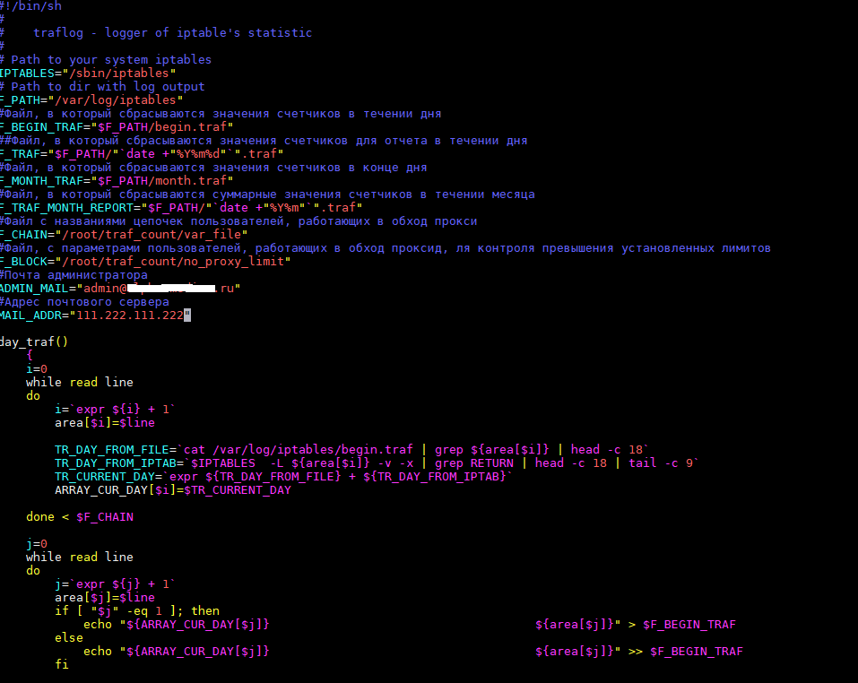

# Сценарии  Bash для автоматизации работы  #

**create_ftp_user.sh** - создание пользователя FTP

**password_generator.sh** - генератор паролей

**sinc_files.sh** - синхронизация каталогов (односторонняя)

**traf_calc.sh** - биллинговая система

**vhosts_back.sh** - резервное копирование каталогов хостинга

